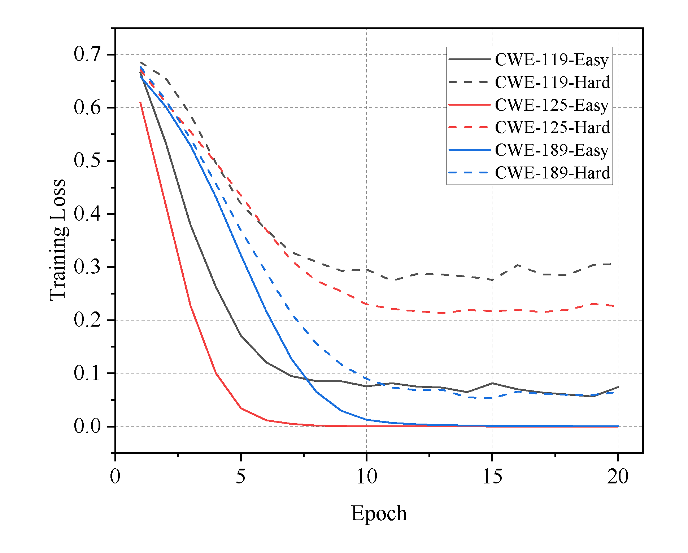

We reorganized some previously collected CVEs and classified them according to CWE, and finally selected three CWEs with more datasets. 
Also, we divided the data of each CWE into two subsets, easy and hard, using the code complexity.

Different CWEs mimic different courses in school (e.g., math and history), and subsets of different complexity mimic different levels of the same course (e.g., middle school and high school). 
By analyzing the results, we find that TokenCNN's loss changes differently when analyzing different CWEs, indicating that it has different learning ability when learning different vulnerability knowledge. 
Meanwhile, the loss converges more slowly on the complex subset, indicating that it has weaker understanding when learning more complex knowledge. 
This scenario is consistent with our human learning process, where some people are more talented in learning mathematics. 
Also, we have a harder time learning high school courses than middle school courses.

